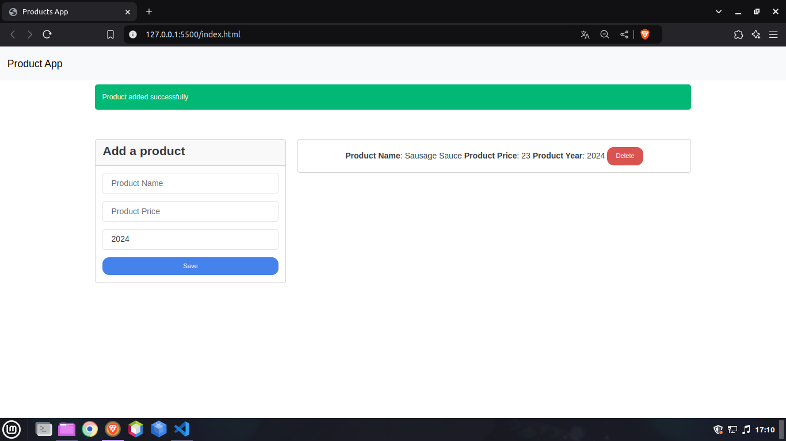
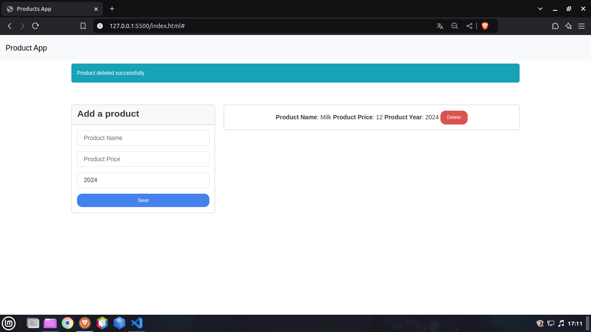
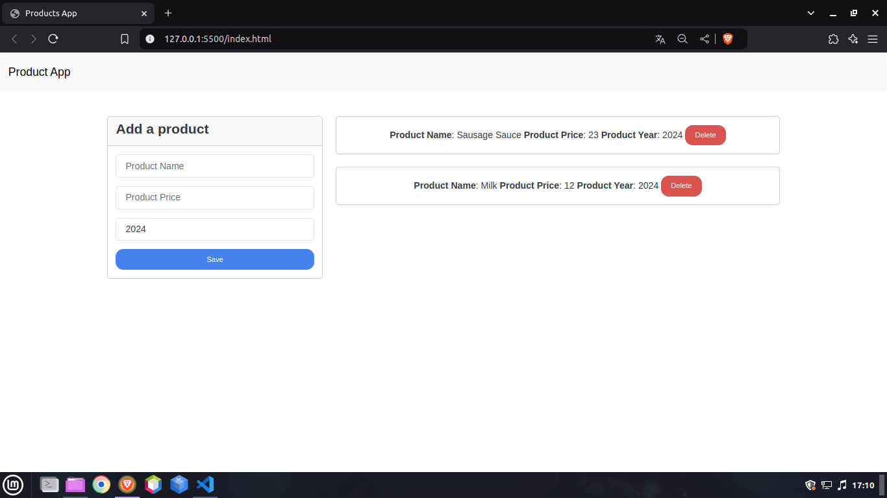

# Products App Using OPP in JS

This project is based on a YouTube tutorial from the channel called Fazt.

Link: [Aplicación de Productos con Javascript Orientado a Objetos - YouTube](https://youtu.be/nqre9kKFRpc?si=JkAim2LHbhvKfnob)

---

## Description

Main Actions: 

+ Create a product

+ Delete a product

+ List products

What's in the code?:

+ DOM Management (Select elements and create new html elements)

+ Introduction to the Bootstrap framework

+ Integrated OPP

---

## Previews

### Creating a product

### Deleting a product

### Listing products

